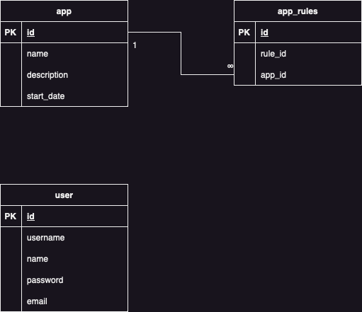

# Servicio de Base de datos

## Configuración inicial

Para poder inicializar el contendor, simplemente se debe crear un archivo .env basandose en el archivo .env.example ubicado en la raiz del proyecto y asignando los valores correspondientes a las variables. Es importante tener en cuenta estos datos, porque también deberán ingresarse en el proyecto del backend para realizar la autenticación y poder acceder a la base de datos.

## Base de datos
Para soportar la aplicación con cada una de las funcionalidades descritas en el contenido del documento de la prueba técnica en el 1er punto, se plantea utilizar una base de datos que estará compuesta por 4 tablas.

La tabla app será la encargada de almacenar información básica de la aplicación a la cual se desea gestionar las reglas solventadas. Esto permitirá poder llevar la lista de las vulnerabilidades corregidas en distintas aplicaciones utilizando el mismo servicio.

La tabla app_rules será la encargada de registrar cada una de las vulnerabilidades resueltas por aplicación, Teniendo como llave foranea el id de las aplicaciones. Se podrán registrar todas las vulnerabilidades resueltas en el servicio y asignarlas a un aplicativo en concreto para posteriormente generar una diferencia entre las vulnerabilidades extraidas del servicio suministrado en la documentación de la prueba técnica y las que están almacenadas dentro de la tabla con el fin de presentar las vulnerabilidades faltantes.

La table user será la encargada de almacenar la información que utilizará el usuario para realizar la autenticación dentro del servicio.

## Definición Contenedor 
Para el contenedor de base de datos, se optó por utilizar una imagen alpine de postgres en su versión 15.3, se utilizó el entrypoint para cargar un script con código SQL que inicializa las bases de datos para poder ser gestionada por el aplicativo backend. Este contenedor se gestiona con Docker Compose, por lo que tenemos un archivo docker-compose.yaml en el arbol del proyecto, este archvio conecta el puerto 5432 del contenedor con el puerto 5432 del host para poder interactuar con la base de datos desde fuera del contenedor. También crea un volumen buscando mantener la persistencia de datos que no nos ofrece solo el contenedor. Para finalizar, el archivo docker-compose.yaml también inicializa una red virtual a la que posteriormente se conectará el cotenedor con el aplicativo backend para poder consultar la base de datos.

