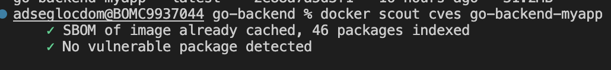

# <strong> Aplicación Completa </strong>

## <strong>Método de uso</strong>

Se debe ejecutar el comando docker-compose build y posteriormente el comando docker-compose up. La primera vez que inicia se va a genera un error, ya que la dependencia de contenedores contempla el inicio del contenedor y no del servicio que ejecuta tal contenedor. Cuando comienza el contenedor del aplicativo aún no ha terminado de inicializar el servicio de postgres, por lo que el aplicativo genera un error al no encontrar la base de datos disponible.

Al terminar la inicialización de la base de datos, se deben bajar los dos contenedores y volver a ejecutarlos, el problema no se volverá a presentar.

## <strong>Flujo de inicio de la aplicación</strong>

Al inicio de la aplicación se genera un usuario con las siguientes credenciales:

usuario: admin
contraseña: secret_password

este usuario se debe utilizar para la ruta de logín y posteriormente utilizar el token que retorna en el header Authorization de cada una de las otras peticiones.

Después de realizar al autenticación en el aplicativo, se debe generar una aplicación de prueba con la ruta de creación de apps. Después de tener una aplicación creada, se pueden comenzar a gestionar las reglas asociadas a la aplicación.

## <strong>Aplicación</strong>

### <strong>Configuración inicial</strong>
Para poder ejecutar el aplicativo, simplemente se debe crear en la carpeta del proyecto un archivo .env que siga la misma estructura del archivo .env.example. En la variable host, se debe agregar el nombre del contenedor de la base de datos y en las demás variables, utilizar las credenciales proporcionadas en la configuración del contenedor.

### <strong>Descripción del problema:</strong>

El objetivo del desafío es desarrollar un api que muestre una lista resumida de vulnerabilidades del estándar NIST, clasificadas por severidad. La aplicación también debe permitir indicar qué vulnerabilidades ya están corregidas o remediadas en la infraestructura para que no aparezcan en el listado. Para lograr esto, se debe implementar una API REST con los siguientes endpoints:

* Endpoint que devuelve la lista completa de vulnerabilidades.
* Endpoint que devuelve la lista de vulnerabilidades resumidas por severidad.
* Endpoint para recibir las vulnerabilidades corregidas o remediadas.
* Endpoint que devuelve la lista de vulnerabilidades resumidas por severidad, excluyendo las vulnerabilidades corregidas ingresadas en el endpoint anterior.

La aplicación debe proporcionar esta funcionalidad para facilitar el seguimiento y la gestión de las vulnerabilidades según su severidad, permitiendo también filtrar aquellas que ya han sido corregidas en la infraestructura.

### <strong>Implementación </strong>
Para dar respuesta al problema planteado con anterioridad, se llevó a cabo el desarrollo de un api utilizando el framework de desarrollo gin que utiliza el lenguaje Go. Además, para realizar la gestión de la base de datos desde el proyecto se utilizó el ORM gorm.

A continuación se listarán las librerías utilizadas para el desarrollo con sus respectivas versiones:

* gin                  => v1.9.1
* godotenv             => v1.5.1
* testify              => v1.8.3
* crypto               => v0.9.0
* gorm                 => v1.25.1
* gorm postgres driver => v1.5.2


#### <strong>Arbol del proyecto </strong>
Para llevar a cabo la implementación del aplicativo se diseñó Propuso la siguiente distribución de carpetas, la cual se puede consultar en la carpeta [go-backend](./go-backend/):
##### <strong>Carpeta config</strong>
En la carpeta config se debe almacenar archivos que contengan datos de configuración que utilice el aplicativo. En este caso tenemos el archivo database.go, el cual está encargado de parametrizar la conexión con la base de datos con la que posteriormente se realizarán consultas para responder los requerimientos

##### <strong>Carpeta entities</strong>
En la carpeta entities se almacenan las entidades o modelos de datos que representan los objetos principales del dominio de la aplicación. En este caso tenemos los archivos app_rules.go, apps.go y users.go que representan cada una de las tablas de las bases de datos y están construidos con el ORM "GORM"

##### <strong>Carpeta handlers</strong>
En la carpeta handlers se encuentran los archivos encargados de recibir, procesar cada una de las peticiones http entrantes al aplicativo y generar una respuesta adecuada.

En esta carpeta encontramos el manejador de aplicaciones (app_handler.go), el manejador de reglas de aplicación (app_rules_handler.go), el manejador de autenticación (login_handler.go), el manejador de usuarios (user_handler.go)

##### <strong>Carpeta middlewares</strong>
Esta carpeta se utiliza para almacenar los middleware, que son componentes de software que se intercalan entre la recepción de una solicitud y la generación de una respuesta en una aplicación web o API.

En este caso dentro de esta carpeta se encuentra el archivo auth_middleware.go, el cual intercepta la petición entrante, ubica el encabezado "Authorization" y revisa que sea un token valida, en caso de que la respuesta sea positiva, la petición seguirá y será procesada, de lo contrario se retornará un problema de autenticación.

##### <strong>Carpeta repositories</strong>
Esta carpeta se utiliza para almacenar la implementación de los repositorios de datos. Un repositorio es responsable de interactuar con una fuente de datos, como una base de datos, y proporcionar métodos y operaciones para acceder, recuperar, crear, actualizar y eliminar datos.

En este caso tenemos 3 repositorios, el repositorio de aplicaciones (app_repository.go), el repositorio de reglas de aplicación (app_rules.go) y el repositorio de usuarios (user_repositoriy.go)

##### <strong>Carpeta Routes</strong>
Esta carpeta se utiliza para almacenar y gestionar las definiciones de las rutas o endpoints de la aplicación. En esta carpeta, se encuentran los archivos o módulos encargados de configurar las rutas y definir cómo se manejan las solicitudes entrantes.

##### <strong>Carpeta services</strong>
La carpeta services se utiliza para almacenar la lógica relacionada con la interacción y consumo de servicios externos, como APIs de terceros, servicios web, bases de datos remotas, entre otros.

En este caso, encontramos el archivo api_cve_service.go. Éste está encargado de proporcionar la capacidad de consumir el api de cves para extraer de ella la información necesaria para responder las solicitudes planteadas.


##### <strong>Carpeta utils</strong>
En la carpeta utils se almacenan los archivos que proporcionan funciones, información o archivos necesesarios para el funcionamiento de los componentes del aplicativo.

En este caso se encuentran el archivo functions.go, el cual contiene funciones que se utilizan para soportar los procesos de los módulos, y el archivo interfaces.go, el cual proporciona las estructuras para definir los tipos necesarios para el funcionamiento del proyecto.

#### <strong>Rutas</strong>
Dentro del aplicativo se encuentran las siguientes rutas:

* Reglas por aplicación
    * GET api/v1/app_rules => Retorna todas las vulnerabilidades cve proporcionadas por el api
    * GET api/v1/app_rules/severity/:severity => Retorna las vulnerabilidades agrupadas por severidad. Recibe un parametro severity, el cual debe tener alguna de estas opciones: ["HIGH","MEDIUM","LOW"]
    * GET api/v1/app_rules/:app_id => Retorna todas las vulnerabilidades resueltas para un app. Recibe como parametro el id del aplicativo, el cual es un número entero.
    * GET api/v1/app_rules/:app_id/:severity => Retorna todas las vulnerabilidades que no se han resuelto en un aplicativo agrupadas por severidad. Recibe un parametro app_id, el cual es un número entero que hace referencia al id de una aplicación y también recibe un parametro severity, el cual debe tener alguna de estas opciones: ["HIGH","MEDIUM","LOW"]
    * POST api/v1/app_rules => Crea una nueva regla y se la asigna a una aplicación. Para realizar esta creación, el método post recibe un objeto con la siguiente estructura:
       ``` javascript
        {
            App_id: int  
            Rule_id: string 
        }
        ```
    * DELETE api/v1/app_rules/:app_id/:rule_id => Este método se encarga de remover la asignación de una regla como resuelta para una aplicación. Como primer paremtro recibe app_id, el cual es un número entero que representa una aplicación dentro de la base de datos, y un segundo parametro rule_id, el cual hace referencia al id de la regla que se quiere remover.
        
* Aplicación

    * GET api/v1/apps => Retorna todas las aplicaciones registradas en la base d datos
    * GET api/v1/apps/:id => Retonar una aplicación puntual identificada por el id. Recibe un parametro id, el cual hace referencia al id asociada a la aplicación dentro de la base de datos.
    * PUT api/v1/apps/:id => Este método permite hacer el cambio del nombre y la descripción de una aplicación. Recibe un parametro en la URL id, el cual hace referencia al código asociado a la aplicación en la base de datos y un body en formato json con la siguiente estructura
       ``` javascript
        {
        	name: string        
        	description: string 
        }
        ```
    * POST api/v1/apps => Este método permite registrar una aplicación dentor de la base de datos. Recibe un body con la siguiente estructura
       ``` javascript
        {
        	name: string        
        	description: string 
        }
        ```

* Usuarios

    * GET api/v1/user => Este método retorna una lista con todos los usuarios registrados en los aplicativos.
    * GET api/v1/user/:username => Este método retorna la información de un usuario en especifico. Recibo como parametro en la url el nombre de usuario que se quiere consultar.
    * PUT api/v1/user/:username => Este método permite hacer la modificación de la contraseña y el correo electronico de un usuario. Recibe como parametro en la url el nombre de usuario que se quiere modificar y en el body el siguiente objetoo

        ```javascript
        {
            password: string 
            Email:    string 
        }
        ```
    * DELETE api/v1/user/:username => Este método permite eliminar un usuario específico. Recibe como parametro en la url el nombre de usuario que se desea eliminar.

    * POST api/v1/user/ => Este método permite registrar un nuevo usuario dentro de la base de datos. Recibe como body el siguiente objeto

        ```javascript
            {
                username: string 
                name:     string 
                password: string 
                email:    string 
            }

        ```
* Autenticación

    * POST api/v1/auth/login => Este método sirve para realizar la autenticación de un usuario y retorna el token que servirá para realizar la autorización en cada una de las peticiones a los demás métodos. Recibe como body el siguiente objeto

        ```javascript
            {
                username: string 
                password string 
            }
        ```

Para facilitar el proceso de prueba de los métodos, en el repositorio se encuenta una colección de postman. La cual luego de ser importada será de gran ayuda para la tarea.


### Contenedor

Para realizar la construcción y el despliegue del aplicativo a un entorno "productivo", se utilizó un dockerfile de 2 etapas, una primera etapa construida con la versión alpina de Golang 1.19 llamada build, la cual está encargada de realizar la construcción del aplicativo en el archivo main, el cual posteriormente será utilizado por la segunda etapa, la cual está construida con la imagen alpine en la versión 3.18

En las 2 etapas del Dockerfile se buscó utilizar imagenes alpine con el fin de entregar al contenedor la configuración necesaria para llevar a cabo la tarea de soportar la aplicación en ejecución. Se expone el puerto 8080 para recibir las peticiones hacia la aplicación.

Para facilitar la gestión del contenedor, se utilizó Docker Compose por medio del archivo docker-compose.yaml donde se enlazaron los puertos 8080 del host y del contenedor. Además, se une el contenedor a una red virtual donde podrá interactuar con el contenedor de la base de datos.

Para verificar la seguridad del contenedor, se utilizó la herramienta Docker Scout para analizar las vulnerabilidades cves de la imagen, teniendo un resultado satisfactorio


## Base de datos

### Configuración inicial

Para poder inicializar el contendor, simplemente se debe crear un archivo .env basandose en el archivo .env.example ubicado en la raiz del proyecto y asignando los valores correspondientes a las variables. Es importante tener en cuenta estos datos, porque también deberán ingresarse en el proyecto del backend para realizar la autenticación y poder acceder a la base de datos.

### Base de datos
Para soportar la aplicación con cada una de las funcionalidades descritas en el contenido del documento de la prueba técnica en el 1er punto, se plantea utilizar una base de datos que estará compuesta por 4 tablas.


La tabla app será la encargada de almacenar información básica de la aplicación a la cual se desea gestionar las reglas solventadas. Esto permitirá poder llevar la lista de las vulnerabilidades corregidas en distintas aplicaciones utilizando el mismo servicio.

La tabla app_rules será la encargada de registrar cada una de las vulnerabilidades resueltas por aplicación, Teniendo como llave foranea el id de las aplicaciones. Se podrán registrar todas las vulnerabilidades resueltas en el servicio y asignarlas a un aplicativo en concreto para posteriormente generar una diferencia entre las vulnerabilidades extraidas del servicio suministrado en la documentación de la prueba técnica y las que están almacenadas dentro de la tabla con el fin de presentar las vulnerabilidades faltantes.

La table user será la encargada de almacenar la información que utilizará el usuario para realizar la autenticación dentro del servicio.

### Contenedor 
Para el contenedor de base de datos, se optó por utilizar una imagen alpine de postgres en su versión 15.3, se utilizó el entrypoint para cargar un script con código SQL que inicializa las bases de datos para poder ser gestionada por el aplicativo backend. Este contenedor se gestiona con Docker Compose, por lo que tenemos un archivo docker-compose.yaml en el arbol del proyecto, este archvio conecta el puerto 5432 del contenedor con el puerto 5432 del host para poder interactuar con la base de datos desde fuera del contenedor. También crea un volumen buscando mantener la persistencia de datos que no nos ofrece solo el contenedor. Para finalizar, el archivo docker-compose.yaml también inicializa una red virtual a la que posteriormente se conectará el cotenedor con el aplicativo backend para poder consultar la base de datos.


## Implementación en nube

Para implementar el backend, se propone utilizar un cluster de ecs ubicado en una red pública, a este cluster le apuntará un balanceador de carga el cual estará encargado de distribuir el trafico entrante a cada una de las task definidas en el cluster y así poder llevar a cabo un escalamiento horizontal en caso de ser necesario por el trafico de peticiones.

Con el fin de exponer el aplicativo de la manera más segura posible, se propone utilizar un apigw conectado al balanceador de carga y con endpoint desactivado. Este apigw estará configurado como origen de una distribución de cloudfront, la cual estará asociada a un WAF que se encargará de proteger la aplicación de peticiones maliciosas.

Además, se propone utilizar un lambda authorizer con los métodos de apigw con el fin de dar una capa extra de seguridad por medio del token. La lambda authorizer validaría que el token de autorización generado por el login que se adjunte en la petición http sea válido.

Para la base de datos, en atención a que el ejercicio exigía que se desarrollara en contendor, la base de datos también se desplegará en un contendor de ecs dentro de una red privada, con todas las configuraciones necesarias para que sea accesible desde el cluster del backend. En caso de no ser necesario el uso de contenedores, se podría cambiar el ecs por una instancia ec2 o una RDS

